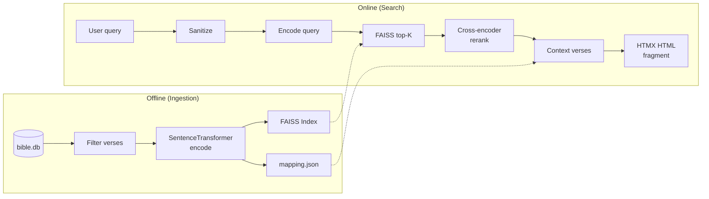

<!-- HuggingFace Spaces frontmatter above -- do not remove -->

<h1 align="center">« Sondez les Écritures »</h1>

<p align="center">
  Semantic search through the French Bible, powered by retrieval-augmented generation.
</p>

<p align="center">
  <a href="https://github.com/antoine-de-daran/rag_bible/actions/workflows/deploy.yml">
    
  </a>
  <a href="https://github.com/antoine-de-daran/rag_bible/blob/master/LICENSE">
    
  </a>
  
  <a href="https://recherche-biblique.com">
    
  </a>
  <a href="https://github.com/astral-sh/ruff">
    
  </a>
</p>

<!-- TODO: Record a demo GIF and place it at docs/demo.gif -->
<!--
<p align="center">
  
</p>
-->

---

## Table of Contents

- [About](#about)
- [Features](#features)
- [Live Demo](#live-demo)
- [Quick Start](#quick-start)
- [Usage](#usage)
- [Architecture](#architecture)
- [Project Structure](#project-structure)
- [Tech Stack](#tech-stack)
- [Development](#development)
- [Deployment](#deployment)
- [Contributing](#contributing)
- [Supporting the Project](#supporting-the-project)
- [License](#license)
- [Acknowledgments](#acknowledgments)

## About

Finding a half-remembered verse in a 35,000-verse corpus is hard when you only remember the idea, not the exact words. Traditional keyword search falls short because biblical language is rich with synonyms, metaphors, and paraphrase.

RAG Bible solves this with **semantic search**: describe a concept in plain French and get the most relevant verses back, ranked by meaning -- not just keyword overlap. It combines a multilingual sentence transformer for broad recall with a cross-encoder reranker for precision, delivering results in under two seconds.

The entire system runs locally with no external API calls, no paid dependencies, and no GPU required. It ships as a single Docker container and is deployed on Hugging Face Spaces for anyone to try.

## Features

- **Semantic search** -- find verses by meaning, not just keywords
- **Two-stage retrieval** -- FAISS vector search for recall, cross-encoder reranking for precision
- **Contextual results** -- each match includes surrounding verses for readable context
- **Instant startup** -- background pipeline loading; UI available in < 1s, search auto-retries until models are ready
- **Fast** -- sub-2s response times on CPU
- **35,000+ verses** -- complete French Bible (AELF translation)
- **PWA-ready** -- offline support via service worker, installable on mobile
- **Per-verse feedback** -- thumbs up/down on results, synced to HuggingFace Dataset
- **Self-contained** -- no external APIs, runs entirely on your machine

## Live Demo

Try it now: **[recherche-biblique.com](https://recherche-biblique.com)**

## Quick Start

### Prerequisites

- Python 3.12+
- [uv](https://docs.astral.sh/uv/) package manager
- `bible.db` placed in `data/` (SQLite database with AELF verses)

### Install and run

```bash
make install    # install dependencies + pre-commit hooks
make ingest     # build FAISS index from bible.db (~1 min)
make serve      # start dev server at http://localhost:8000
```

Open [http://localhost:8000](http://localhost:8000) in your browser.

## Usage

| Method | Endpoint       | Description                              |
|--------|----------------|------------------------------------------|
| GET    | `/`            | Main SPA entry point                     |
| POST   | `/search`      | Search (accepts `query` form field, returns HTML fragment) |
| GET    | `/health`      | Health check (200 `ok` or 503 `loading`) |
| GET    | `/robots.txt`  | Robots.txt for crawlers                  |
| GET    | `/sitemap.xml` | XML sitemap for crawlers                 |
| POST   | `/feedback`    | Per-verse feedback (fire-and-forget, returns 204) |

## Architecture



**Ingestion** reads `bible.db`, filters short/non-content verses (< 10 chars or < 3 words), encodes them with a multilingual sentence transformer, L2-normalizes the embeddings, and stores them in a FAISS `IndexFlatIP` index alongside a JSON mapping of verse metadata.

**Search** sanitizes the user query, encodes it with the same model, retrieves the top-K candidates via FAISS inner product (equivalent to cosine similarity for normalized vectors), then reranks with a cross-encoder. Raw reranker scores are sigmoid-normalized so 0.5 maps to the decision boundary. Each result is returned with surrounding context verses, bounded by book.

## Project Structure

```
config.py           # Central configuration (paths, models, thresholds)
app.py              # FastAPI application + background pipeline loading
rag/                # Core package
  embeddings.py     #   Model loading and text encoding
  ingest.py         #   Ingestion: filter, embed, index
  retrieve.py       #   Two-stage retrieval: FAISS + cross-encoder
templates/              # Jinja2 HTML fragments
  results.html          #   Search results (Embla Carousel)
  context_verses.html   #   Surrounding context verses
  loading.html          #   Loading state with HTMX auto-retry
  error.html            #   Error display
  no_results.html       #   No results feedback
static/             # Frontend assets (no build step)
  index.html        #   SPA entry point (HTMX)
  styles.css        #   Design system (CSS custom properties)
  app.js            #   Component initializers
  service-worker.js #   Cache-first PWA worker
tests/              # Test suite
  test_app.py       #   App endpoint tests
  test_ingest.py    #   Ingestion pipeline tests
  test_retrieve.py  #   Retrieval logic tests
data/               # Generated artifacts (gitignored)
  bible.db          #   SQLite source database
  index.faiss       #   FAISS vector index
  mapping.json      #   Verse metadata mapping
```

## Tech Stack

| Component       | Technology                                           | Role                                  |
|-----------------|------------------------------------------------------|---------------------------------------|
| Embeddings      | `paraphrase-multilingual-MiniLM-L12-v2`             | 384-dim multilingual sentence encoder |
| Reranker        | `mmarco-mMiniLMv2-L12-H384-v1`                      | Cross-encoder for precision reranking |
| Inference       | ONNX Runtime                                         | Optimized CPU inference backend       |
| Vector index    | FAISS (`IndexFlatIP`)                                | Fast inner-product similarity search  |
| Backend         | FastAPI + Uvicorn                                    | Async HTTP server                     |
| Frontend        | HTMX + Embla Carousel + vanilla CSS/JS               | No-build interactive UI               |
| Templating      | Jinja2                                               | Server-rendered HTML fragments        |
| Package manager | uv                                                   | Fast Python dependency management     |
| Linting         | Ruff                                                 | Lint + format                         |
| Type checking   | mypy (strict)                                        | Static type analysis                  |
| CI/CD           | GitHub Actions                                       | Quality gate + deploy to HF Spaces    |

## Development

All commands use `uv`. See the [Makefile](Makefile) for details.

```bash
make test-unit        # unit tests (fast, no models needed)
make test-integration # integration tests (requires models + data/)
make test-all         # all tests
make lint             # ruff check + format check
make typecheck        # mypy strict
make check            # lint + typecheck
make format           # auto-fix formatting and lint issues
```

Run a single test:

```bash
uv run pytest tests/test_app.py::test_name -v
```

## Deployment

### Docker

```bash
make docker-build   # build image
make docker-serve   # run on port 7860
```

### Hugging Face Spaces

The project deploys automatically via GitHub Actions. On every push to `master`:

1. **Quality gate** -- runs lint and unit tests
2. **Deploy** -- syncs code to the [HF Space](https://huggingface.co/spaces/adedaran/rag-bible), which builds the Docker image and serves the app

The `data/` directory (FAISS index, mapping, database) is stored on the HF Space via Git LFS and is not re-uploaded on each deploy.

## Contributing

Contributions are welcome. Please read [CONTRIBUTING.md](CONTRIBUTING.md) for setup instructions, coding conventions, and the pull request process.

## Supporting the Project

If you find this tool useful, consider supporting its development:

[](https://github.com/sponsors/antoine-de-daran)
[](https://ko-fi.com/adedaran)

## License

This project is licensed under the MIT License. See [LICENSE](LICENSE) for details.

## Acknowledgments

- [AELF](https://www.aelf.org/) for the French Bible translation
- [Sentence Transformers](https://www.sbert.net/) for multilingual embedding models
- [FAISS](https://github.com/facebookresearch/faiss) for efficient similarity search
- [FastAPI](https://fastapi.tiangolo.com/) and [HTMX](https://htmx.org/) for the web stack
- [Hugging Face](https://huggingface.co/) for free Spaces hosting
